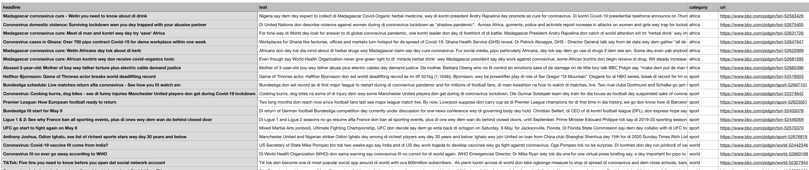

# BBC Pidgin Scraper
A simple python scraper that allows you create pidgin corpus from the BBC Pidgin website - https://www.bbc.com/pidgin


## Install Requirements

- requests
- beautifulsoup4
- PyYAML

```
pip install -r requirements.txt
```

## Using the Scraper

**Command line arguments:**

```--output_file_name```  : Indicates output file name where scraped articles will be saved. File name must have a csv extension. Default value = ```bbc_pidgin_corpus.csv```

```--no_of_articles```  : Indicates the total number of articles you want to scrape. If set to -1, all articles found will be scraped. Default value = ```-1```

```--categories```  : Specifies the news categories to scrape from. Categories must be separated by a comma, eg. ```sport,entertainment,world``` If set to ```all```, all categories will be scraped from.  Default value = ```all```

```--time_delay``` : If set to True, there will be a delay of 10 seconds between consecutive url requests (recommended). Default = ```True```

```--spread```: If passed, number of articles collected is spread across all categories passed in. If `most_popular` in categories, all its articles are collected and the remainder is spread across other categories. 

To start scraping, you can run the following sample commands:

```
git clone https://github.com/keleog/bbc_pidgin_scraper
cd bbc_pidgin_scraper
python scraper.py --no_of_articles=-1 --output_file_name=data/all_corpus.tsv --categories=all --time_delay=True
```

To scrape a finite number of articles
```
$ python scraper.py --no_of_articles=100 --output_file_name=data/corpus.tsv --categories=all 
--time_delay=True --spread
```

**Sample file output:**





## Scraped Data:

Two files containing all articles in the BBC Pidgin archive are in the [data folder](./data)

- **pidgin_corpus.csv**  is in the format in the Sample section. 

- **pidgin_corpus.txt** is a free-flowing text file containing headline and article text separated by new lines. 


## NB:
The BBC regularly changes the HTML class attributes in its website, so this scraper might be out of out of date. 

**Scraper works fine as at 8th of August, 2021.**


## License
**MIT**: See the [LICENSE](LICENSE) file for more details.
